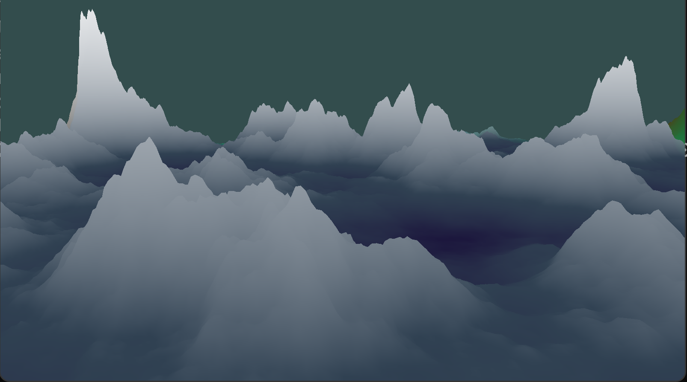
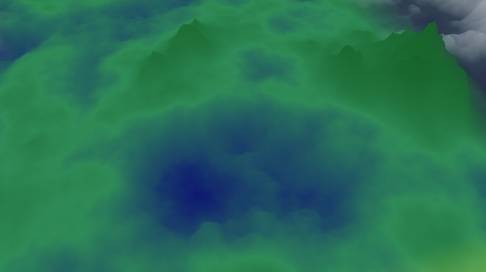
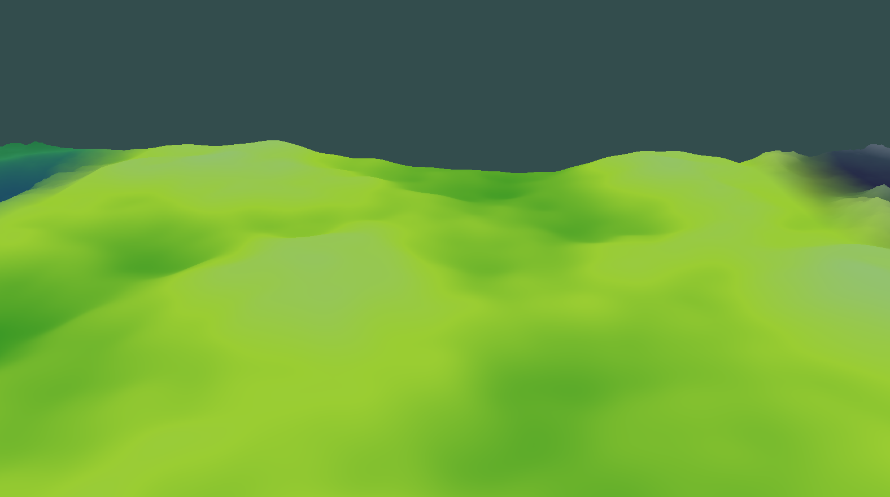
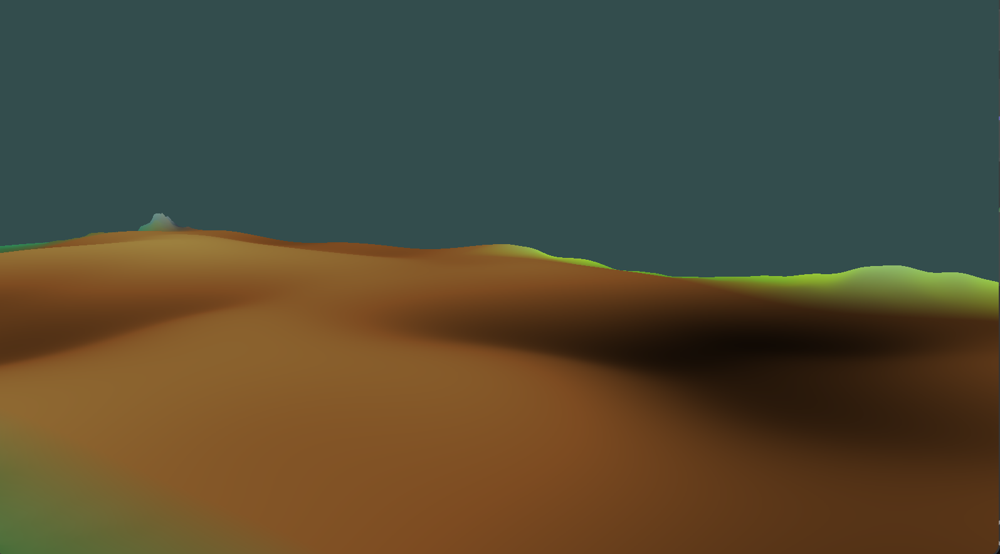

# Procedural Terrain Generation using Perlin Noise

https://github.com/a-sanjana/procedural-terrain/assets/115346209/fec3b6fe-d66f-414f-ace4-fdff661fba65

## About
Generates four different types of biomes - mountains, valleys, plains and deserts. Their boundaries are interpolated.

    
    
    
    

## Controls
- W,A,S,D,Left CTRL,Left Shift : Moving Front, Back, Left, Right, Up, Down
- P : Default Camera View
- M : Show Mesh
- K : Show Axes

## References
1. https://dl.acm.org/doi/10.1145/325165.325247
2. https://github.com/Reputeless/PerlinNoise
3. https://cs.nyu.edu/~perlin/noise/
